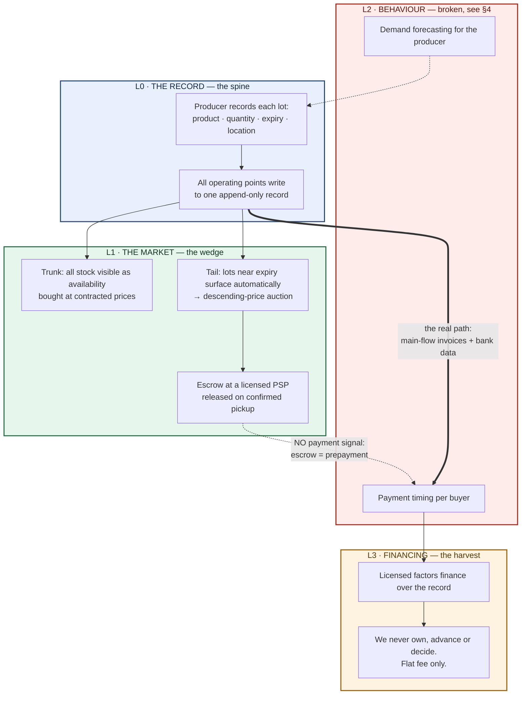
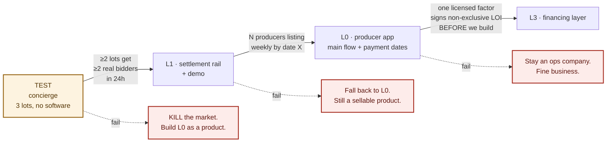

# The ecosystem, layer by layer

> Working document, for me. Written 26 July 2026, after nine research runs and three
> independent adversarial reviews.
>
> This supersedes the dual-attestation plan in [PROJECT_CONTEXT.md](archive/PROJECT_CONTEXT.md)
> and [ARCHITECTURE.md](archive/ARCHITECTURE.md), which describe a product the research killed.
> Evidence: [RESEARCH-FINDINGS.md](RESEARCH-FINDINGS.md).
>
> Anything marked **[OPEN]** is undecided. Do not silently resolve it in code.

---

## 1. What the whole thing is

**A market for stock that is about to expire, sitting on top of the producer's own
inventory record — and, later, the financing that runs over the flow that record sees.**

One object moves through every layer: **the lot**. It is recorded, it is sold, its payment
becomes a data point, and its receivable is financed. If the object changes between layers,
this is four companies, not one.

---

## 2. The layers

### L0 — the record (the spine)

| | |
|---|---|
| **What it does** | Every lot recorded: product, quantity, expiry, location. All of a producer's operating points write to one record. Append-only — a correction is a new event, never an edit. |
| **What it produces** | A continuous, timestamped inventory history per producer. |
| **What it needs** | One producer willing to type. That is the only real dependency in the whole stack. |
| **Who pays** | The producer, as a subscription. |
| **Needs a blockchain?** | **No.** Postgres with an append-only log and role separation does this, and eIDAS qualified electronic ledgers (Reg. 910/2014 art. 45k–45l) carry a legal presumption a chain record does not. |

**The claim that must never be made here:** that this prevents falsification. It does not.
If a branch enters 96 when there are 90, the record stores the lie faithfully — and, worse,
makes it look verified to whoever reads it downstream. What it prevents is *retroactive
adjustment*, which is how the fraud is actually committed. Say only that.

### L1 — the market (the wedge)

| | |
|---|---|
| **What it does** | Two price mechanics on the same data. **Trunk:** all stock visible as availability, bought at contracted prices, no auction — nobody changes how they buy. **Tail:** lots nearing expiry surface automatically and enter a descending-price auction. |
| **What it produces** | Transactions: who bought, at what price, when they collected. |
| **What it needs** | Density, not scale — roughly 40–80 active sellers and 50–100 qualified buyers *per category and radius*, not in total. |
| **Who pays** | Per-transaction fee. Flat or per-transaction, **never a share of the spread.** |
| **Needs a blockchain?** | **This is the only layer where it earns its place** — settlement and delivery confirmation resolving together, atomically. |

**Escrow constraint, decided by research:** we cannot hold buyer funds ourselves. That is
money remittance under Romanian Law 209/2019 and Serbian Law on Payment Services art. 10.
The technical-service exemption applies *only* if we never possess the funds. Stablecoin
escrow is worse, not better — MiCA treats fiat-referencing tokens as e-money and therefore
as funds under PSD2. **The only lawful structure is a licensed PSP holding the money while
we control the rules.** [OPEN] No single PSP covers both markets — Stripe does not support
Serbia as an account country.

**Channel conflict, unresolved.** A public distress auction teaches contracted buyers to
wait for the discount and invites retroactive price demands. [OPEN] Private per-buyer
visibility rather than an open market may be required — which also resolves the commercial
secrecy problem that archive/ARCHITECTURE.md §2 deferred as [OPEN — C7].

### L2 — behaviour

| | |
|---|---|
| **What it was meant to do** | Observe how long each buyer takes to pay, natively, through our own escrow. Feed pricing (good streak → better price, earlier access) and demand forecasting. |
| **Status** | **The payment half is broken. See §4.** |
| **What survives** | Forecasting. And note the one clean slice: for surplus sold through our market, our sale *is* the final consumption — no sell-in/sell-out distortion on that data. |

### L3 — financing (the harvest)

| | |
|---|---|
| **What it does** | Licensed factors and banks finance receivables over the record. |
| **What we never do** | Buy a receivable, advance funds, hold client money, decide who is funded. That boundary is what keeps us licence-free in both countries. |
| **What we sell them** | Reduced verification cost. No factor in the region uses goods-receipt or lot data today — the trigger is invoice plus buyer confirmation. |
| **Who pays** | The factor, flat or per transaction. |
| **Where first** | **Serbia.** Art. 30 of the factoring law overrides contractual bans on assignment when a licensed factor is the buyer. Romania has no equivalent. |

Adjacent mechanism, no licence and no third-party capital: **dynamic discounting** — the
buyer settles its own invoice early for a discount. Explicitly outside the IAS 7 supplier
finance definition, so it creates no reclassification risk for the buyer's CFO. A real,
citable argument post-Greensill — and it evaporates the moment a third-party funder appears.

---

## 3. Where a blockchain earns its place

| Layer | Justification | Strength |
|---|---|---|
| L0 record | many cheap writes; record outlives the company | weak — Postgres + eIDAS wins today |
| L1 market | escrow and atomic settlement | **strong — the only one that matters now** |
| L2 behaviour | buyer carries their history between platforms | moderate |
| L3 financing | a registry no single factor owns | strong, but only at scale |

**Only L1 needs it on day one.** Everything else earns it later or never. Better to know
that now than to be told it on stage.

One technical note: "all branches write to one shared record" is hostile to Solana's
parallel execution — concurrent writes to the same account serialise and fail under load.
The correct design shards state per lot, which abandons the literal shared-record idea.

---

## 4. The break — record it so I don't rebuild it

**L1 does not feed L2.** I had this wrong, and two independent reviews caught it.

Escrow means prepayment. Prepayment eliminates trade credit. No trade credit means **no
payment behaviour to observe** — every buyer pays instantly, by construction. It is not a
volume problem that growth solves; a million escrowed auctions contain zero payment-discipline
signal. The mechanism that makes L1 lawful destroys the signal L2 was meant to harvest.

**And L1 would not have fed L3 either**, for a second reason: surplus is an adversely
selected corner of a producer's business. The receivable a factor finances is the main
contracted invoice to a large chain, which never touches the platform.

**Consequence.** The path to L3 does not run through the auction. It runs through **L0
seeing the producer's main flow** — invoices, deliveries and settlement at real payment
terms — which is precisely the gap the research confirmed: *no state system in either
country records a payment date.* That is the durable asset, and it lives in the boring
layer.

The expected banker's question, to have an answer for before anyone stands up:

> *"If every trade on your platform is prepaid through escrow, there is no receivable and no
> payment behaviour — so what exactly are you asking us to finance?"*

Honest answer: nothing yet. Financing needs main-flow data we do not have, and that is what
L0 is for.

---

## 5. Build order and gates

Every gate has a date, a threshold, and a **kill branch**. A gate that can only postpone is
not a gate — it is how a roadmap becomes a way of keeping every option alive forever.

**Gate 0 — the concierge test. Before any Anchor code.**
Three real lots, 15–20 qualified buyers in one category and radius, falling-price offer by
message, buyer pays the producer directly, we never touch money. €300, one week.
*Kill rule, preregistered:* if fewer than two of three lots attract two binding bidders
within 24 hours, or net recovery does not beat the seller's existing route, the market is
dead — not postponed.
**Scheduling problem:** this needs Vladislav, who is unavailable until 8 August. So it runs
8–15 August, leaving ten days. [OPEN] Whether that is acceptable, or the demo proceeds
without the test.

**Gate 1 → L0.** N producers recording lots weekly by a fixed date. No market without goods.

**Gate 2 → L3.** Not a data threshold — a **partner**. One licensed factor signs, non-exclusively,
that it would use the record, *before* the layer is built. Data with no buyer for it is a museum.

---

## 6. Degradation — the real robustness

Not parallel modules as a hedge. Each failure drops to the layer below, which is already a
sellable product:

- **L3 fails** → market plus operational tool. Good business.
- **L2 fails** → a market that works. Business.
- **L1 fails** → the producer's operational tool. Highest probability of working of anything here.
- **L0 fails** → nothing works. The only true dependency.

Independent in code, **sequential in commitment.** Never run two in parallel.

---

## 7. Open decisions

| | Decision | Blocked on |
|---|---|---|
| 1 | Summit selection process and deadline — is a written application the real gate? | Vladislav |
| 2 | The ten operating points: own branches or independent distributors? Decides L0's shape entirely | Vladislav |
| 3 | Which PSP covers both Serbia and Romania for conditional B2B payouts | me — research |
| 4 | Open market vs. private per-buyer visibility (channel conflict + commercial secrecy) | the test |
| 5 | Whether the concierge test runs before the demo at all | the calendar |
| 6 | Are Food Stock and PalletClearance already operating in RO/RS? | me — one hour |
| 7 | My own role — CEO-side, not CTO. Needs saying to Vladislav before the sprint, not after | me |
