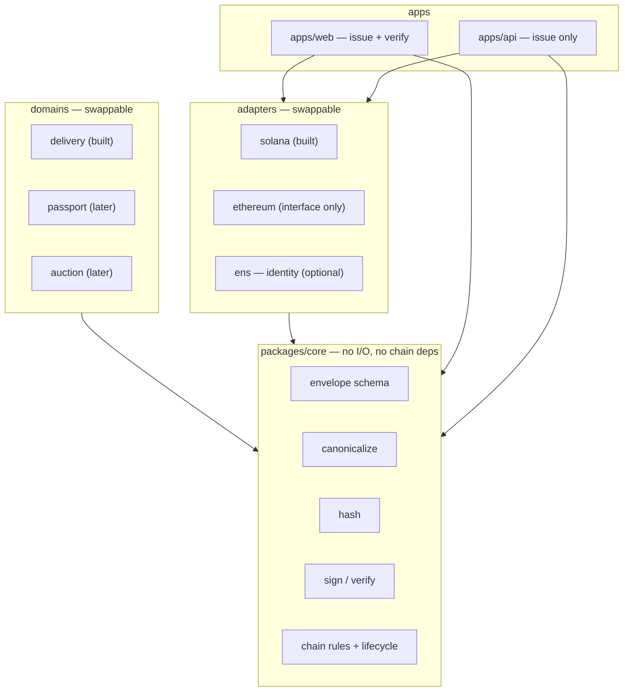

# Verifiable Business Event Ledger — technical brief

Status: draft for the ETH Belgrade × Superteam Balkan hackathon, 26–27 August 2026, Sava Congress Center.
Written 22 August 2026. Nothing is built yet.

---

## 1. What it is

A small library and a demo application that turn a business document event — a delivery, an acceptance, a
correction — into a signed, hashed record whose integrity anyone can verify without our servers, and whose
hash is anchored on a public chain so nobody can quietly rewrite history.

The document content itself stays off-chain. Only a hash and minimal public metadata are anchored.

The core is deliberately domain-agnostic and chain-agnostic. The domain (which document types exist, what
fields they carry) and the ledger (Solana, Ethereum, or none) are both plug-in layers around a fixed core.

---

## 2. Why this shape and not another

Two companies transact against one shared record. Today that record lives in one party's ERP, or in a PDF,
or in an email thread. When the numbers disagree later — delivered 1,000, accepted 940 — the dispute is not
about the goods. It is about whose copy of the number is the real one, and the party holding the system of
record can change their copy.

Relevant facts, not assumptions:

- **Serbia has legislated exactly this problem.** *Zakon o elektronskim otpremnicama* (Sl. glasnik RS 94/2024)
  creates a central e-delivery-note system run by an intermediary inside the Ministry of Finance. The
  document locks on send; the recipient confirms physical receipt within 3 business days; an *ePrijemnica*
  with accepted-vs-received quantities line by line is due within 8 days; partial rejection is supported
  (Art. 8(3)); the sender has 30 days to align; silence counts as rejection. Retention in the private sector
  is 10 years. **Private-sector obligation starts 1 October 2027.**
- So roughly 80% of the naive "put delivery notes on a blockchain" idea is already being built by the state,
  for free, with legal force. Competing with it is not a plan.
- Three things it appears not to cover. These are the wedge, and two of them still need confirmation:
  1. **Post-acceptance correction.** Art. 7(7) allows cancellation only up to confirmation of physical
     receipt. No amendment path *after* acceptance was found in the law or the rulebook. Discrepancies that
     surface a week later (short-shipped case discovered at store level) have nowhere to go.
     *Status: not found — needs a lawyer's confirmation, not ours.*
  2. **Cross-border.** Art. 2(2) does cover movements that partially cross Serbian territory, and the
     February 2026 rulebook amendments added import/export fields. But a foreign supplier has no account in
     the Serbian system, so for imports the record is effectively one-sided.
     *Status: inferred, unverified.*
  3. **Anything that is not a delivery note.** Commercial rules, allocation decisions, auction outcomes,
     quality attestations, discount authorisations — none of these have a neutral record anywhere.
- What a public chain adds over a state database is neutrality: no single operator, including us, can
  rewrite the ordering. That is the whole claim. It is not proof that the goods were real.

What we are **not** claiming: legal compliance, regulatory certification, or proof of truth. Integrity of a
record is not the same as the record being true. This distinction is stated explicitly in the demo.

---

## 3. Scope for the hackathon

Build:

1. A frozen event envelope + deterministic hashing + ed25519 signing, as a dependency-light TypeScript
   package with no I/O.
2. A ledger adapter interface with one working implementation: Solana devnet, SPL Memo.
3. One domain: delivery → acceptance-with-discrepancy → correction.
4. A web app that issues events, anchors them, and verifies them — including verifying a tampered record
   and showing exactly which field broke the hash.
5. A minimal issuing API (one serverless route + blob storage), because issuing needs a signing key and
   persistence. Verification needs neither and runs entirely in the browser.

The single most important property of the demo: **the browser verifier and the API import the same core
package.** That is the only structural reason they cannot disagree about what a valid record is.

Not building: a custom on-chain program, compressed NFTs, a token, a wallet, multi-tenant auth, a second
chain adapter. All of those are hours we do not have and none of them change the argument.

---

## 4. Data model

### 4.1 Event envelope

Frozen at v0.1. Everything else is built on top of this and must not change during the hackathon.

```json
{
  "schema": "urn:vbel:event:delivery-dispatched:v1",
  "eventId": "01J...",
  "subjectId": "urn:vbel:shipment:9f2c...",
  "issuerId": "urn:vbel:org:supplier-a",
  "issuedAt": "2026-08-26T09:14:00Z",
  "previousEventHash": null,
  "payloadHash": "sha256:3f1ea618...",
  "status": "ACTIVE",
  "policyId": "urn:vbel:policy:v1",
  "privacy": "off-chain",
  "nonce": "b7c1..."
}
```

- `payloadHash` covers the business document, which is stored off-chain.
- `previousEventHash` chains an event to the one it follows for the same subject. This is what makes
  reordering or silent insertion detectable.
- `status` is `ACTIVE` | `SUPERSEDED` | `REVOKED`. Records are never overwritten or deleted — a correction
  is a **new** event that supersedes an earlier one, and both remain in the chain. This is not a
  stylistic choice: deletion is incompatible with both the anchoring model and the retention obligation.
- `issuerId` is a plain string. That is what makes the identity layer pluggable — an ENS name, a `did:web`,
  or later an X.509/eIDAS certificate all fit the same field without a schema change.
- `privacy: "off-chain"` is the default and the only value we ship. Personal and confidential commercial
  content never goes on a public chain.

### 4.2 Hashing

Deterministic serialisation is the entire foundation. Two implementations must produce byte-identical
output for the same object, or every verification downstream is meaningless.

- **RFC 8785 (JSON Canonicalization Scheme)**, via the `json-canonicalize` library. Do not hand-roll this.
- `eventHash = sha256(canonicalize(envelope-without-signature))`
- Known failure modes we guard with tests: never emit `undefined`; encode large integers as strings, never
  as JS numbers; reject `NaN`, `Infinity`, and lone surrogates at the boundary rather than serialising them.
- One committed cross-language test vector (fixed input → fixed hex hash) so any future implementation in
  another language can prove it agrees.

### 4.3 Signing

ed25519 over the canonical bytes, via `@noble/ed25519`. The signature is attached alongside the envelope,
not inside the hashed region.

---

## 5. Flow

```mermaid
flowchart LR
  A["Business payload<br/>(off-chain JSON)"] --> B["RFC 8785<br/>canonicalize"]
  B --> C["SHA-256<br/>payloadHash"]
  C --> D["Envelope<br/>+ previousEventHash"]
  D --> E["RFC 8785 + SHA-256<br/>eventHash"]
  E --> F["ed25519 sign<br/>(issuer key)"]
  F --> G["LedgerAdapter.anchor()"]
  G --> H["Solana devnet<br/>SPL Memo tx"]
  H --> I["AnchorReceipt<br/>(chain-neutral)"]
  I --> J["Verifier<br/>(browser, no backend)"]
```



Demo sequence on stage:

1. Supplier issues a dispatch event for 1,000 units. Anchored. Tx link shown.
2. Buyer issues an acceptance event for 940 units, chained to the first. Anchored.
3. Someone edits the stored payload to say 1,000. The verifier goes red and names the field that broke.
4. A correction event is issued: the earlier record moves to `SUPERSEDED`, the new one is `ACTIVE`, both
   are still in the chain and both still verify.

Step 3 has to be live tampering of stored data, not a canned "invalid" state. That is why there is a
backend at all.

---

## 6. Architecture



The rule that makes this modular rather than merely layered: **`packages/core` imports nothing from
`adapters` or `domains`.** Dependencies point inward only. Swapping Solana for Ethereum means writing one
new file that satisfies `LedgerAdapter` and changing one line of configuration. Nothing in core, in the
domain, or in the UI knows which chain is underneath.

```ts
interface LedgerAdapter {
  anchor(eventHash: string, metadata: PublicMetadata): Promise<AnchorReceipt>;
  verify(receipt: AnchorReceipt, eventHash: string): Promise<VerificationResult>;
  revoke?(receipt: AnchorReceipt, reasonHash: string): Promise<AnchorReceipt>;
  network(): LedgerNetwork;
}
```

`AnchorReceipt` is chain-neutral by construction: network id, reference (tx signature / tx hash), block or
slot, timestamp, and the anchored hash. Nothing Solana-shaped leaks above the adapter boundary.

---

## 7. Stack

| Layer | Choice | Note |
|---|---|---|
| Language | TypeScript, strict | monorepo, pnpm workspaces |
| Canonicalisation | `json-canonicalize` | RFC 8785 |
| Hash | `sha256` (WebCrypto / `@noble/hashes`) | same result both runtimes |
| Signatures | `@noble/ed25519` | no native deps, works in browser |
| Chain | `@solana/web3.js` + `@solana-program/memo` | devnet |
| Identity (optional) | `viem ≥ 2.35.0`, `@ensdomains/ensjs ≥ 4.2.3` | ENS subnames + text records, L1 only |
| Web | Next.js + Tailwind | one app, two routes: issue, verify |
| API | one Vercel serverless route + Blob | issuing key + payload storage |

ENS is a separate decision, not a dependency. It buys `supplier-a.something.eth` as a resolvable issuer
identity plus a text record pointing at the issuer's public key, and it is worth roughly 8–10 hours and one
bounty. If it is not decided by Sunday midday it does not go in.

Standards we reference but do not implement: W3C Verifiable Credentials 2.0, GS1 EPCIS 2.0, GS1 Digital
Link, UN/CEFACT UNTP Digital Traceability Events. The envelope is shaped so these can be mapped onto it
later; pretending to implement them in two days would be worse than not mentioning them.

---

## 8. Open decisions

1. **Two-party signing.** Does an acceptance event counter-sign the dispatch event, or merely chain to it
   by hash? Counter-signing is a stronger claim and more work. This changes the core, so it has to be
   settled before core is written.
2. **ENS in or out.** Sunday midday deadline.
3. **Whether the correction gap in the Serbian law is real.** Affects what we say, not what we build.
4. **Envelope-level vs. higher-level positioning** — whether the thing we own long-term is the envelope
   standard or the applications sitting on it. Not a hackathon question, but it shapes what we say to
   judges.

---

## 9. Hackathon context

- ETH Belgrade × Superteam Balkan, 26–27 August 2026, Belgrade Blockchain Week.
- Bounties visible so far: ENS $1,000, Superteam $2,000.
- Existing projects are allowed; chain choice is free.
- Hard requirement from our side: something live, working, and deployed on chain — not slides.
- Team: Stefan (dev), Vladislav (commercial/PM). Third developer slot open.

Estimated effort for the scope in §3: roughly 46–58 hours across the team. `packages/core` is about
12–14 of those and is blocked by nothing except decision 1 above.
